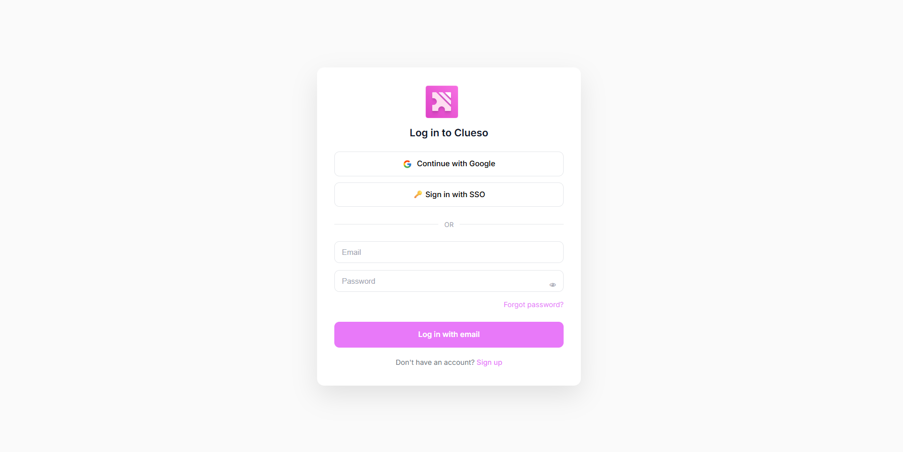
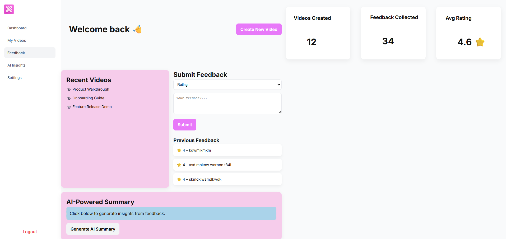
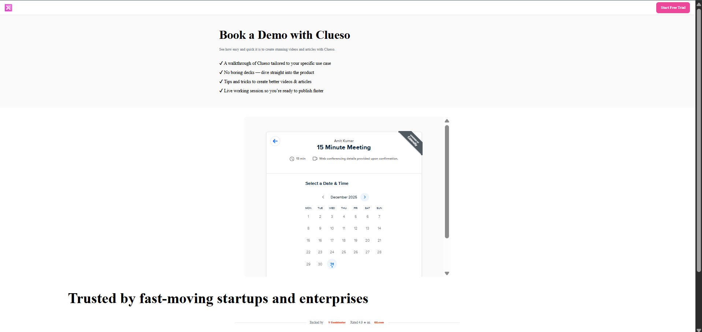

## Clueso – Full Stack Clone

This project is a full-stack clone inspired by Clueso, built as part of an internship assignment.
The goal of this project is not to recreate Clueso fully, but to demonstrate system design understanding, frontend–backend integration, and clean implementation of core features.

## Tech Stack

# Frontend

HTML

CSS

JavaScript (Vanilla)

# Backend

Node.js

Express.js

MongoDB (Mongoose)

JWT Authentication

Nodemailer (for password reset)

Google OAuth (Passport)

## Core Features Implemented
1. User Authentication & Onboarding

User signup with email & password

User login with JWT-based authentication

Google OAuth login

Forgot password & reset password flow using email

Session handling using localStorage (JWT)

2. Dashboard

Protected dashboard (only accessible when logged in)

Sidebar navigation (Dashboard, Videos, Feedback, AI Insights, Settings)

SPA-like behavior (content switches without page reload)

Logout functionality

3. Feedback Collection

Feedback submission form (rating + message)

Feedback stored in MongoDB

User-specific feedback listing on dashboard

Auth-protected backend APIs

4. AI-Powered Insights (Mocked)

AI insights section on dashboard

Mock AI summary generation (documented as mock)

Designed so a real AI/LLM API can be plugged in later

5. Data Management

MongoDB used for:

Users

Feedback

Clean separation of models, controllers, and routes

## screenshots

### Landing Page

### Login Page

### Dashboard

### Feedback Section

### Book Demo page

## Project Structure (Simplified)
clueso-clone/
│
├── backend/
│   ├── src/
│   │   ├── controllers/
│   │   ├── models/
│   │   ├── routes/
│   │   ├── middleware/
│   │   └── config/
│   ├── server.js
│   └── .env
│
├── frontend/
│   ├── index.html
│   ├── login.html
│   ├── signup.html
│   ├── dashboard.html
│   ├── book-demo.html
│   ├── css/
│   ├── js/
│   └── assets/
│
└── README.md
## Architecture Overview
Frontend (HTML/CSS/JS)
        |
        |  fetch() + JWT
        |
Backend (Node + Express)
        |
        |  Mongoose
        |
MongoDB

Frontend communicates with backend using REST APIs.

Backend handles authentication, data validation, and database access.

JWT is used for securing protected routes.

Frontend stores JWT in localStorage and attaches it in API requests.

## API Summary

### Authentication
- `POST /api/auth/signup` – Create a new user
- `POST /api/auth/login` – Login user and return JWT
- `GET /api/auth/google` – Google OAuth login
- `POST /api/auth/forgot-password` – Send password reset email
- `POST /api/auth/reset-password` – Reset password using token

### Feedback
- `POST /api/feedback` – Submit user feedback (protected)
- `GET /api/feedback` – Fetch logged-in user’s feedback (protected)

### AI (Mock)
- AI insights are generated on the frontend using mocked logic
- Designed so a real AI/LLM API can be integrated later

## Setup & Installation
### Prerequisites

Node.js (v18+ recommended)

MongoDB (local or Atlas)

Git

# 1. Clone the repository
git clone <repo-url>
cd clueso-clone
# 2. Backend Setup
cd backend
npm install

## Create a .env file inside backend:
PORT=5000
MONGO_URI=mongodb_connection_string
JWT_SECRET=jwt_secret
EMAIL_USER=email
EMAIL_PASS=email_password
GOOGLE_CLIENT_ID=google_client_id
GOOGLE_CLIENT_SECRET=google_client_secret

# 4.Start backend server:
npm start

## Backend will run on:
http://localhost:5000

# 3. Frontend Setup

No build step required.

Simply open:

frontend/index.html

## How to Run the Project Locally

Start MongoDB

Start backend (npm start)

Open frontend in browser

Sign up or log in

Access dashboard and submit feedback

# Design Decisions & Assumptions

Vanilla JS used intentionally to show core understanding without frameworks.

JWT stored in localStorage for simplicity .

AI insights are mocked, as allowed by the assignment, and clearly documented.

Calendly iframe used for “Book a Demo” page instead of building a custom calendar.

Dashboard behavior is SPA-like but implemented without React to keep scope controlled.

Focus was on correct architecture and flows, not pixel-perfect UI cloning.

# What Is Not Implemented (By Design)

Actual video processing or AI generation

Browser extension (only documented interaction)

Real-time collaboration

These were intentionally excluded to keep the scope aligned with the assignment timeline.

# Conclusion

This project demonstrates:

Full-stack integration

Authentication and authorization

Clean backend structure

Frontend–backend communication

Thoughtful design decisions

It is built to be clear, extensible, and easy to review.

## This project prioritizes correct architecture, clean data flow, and clear system design over production-level optimizations, aligning with the scope and goals of the assignment.
